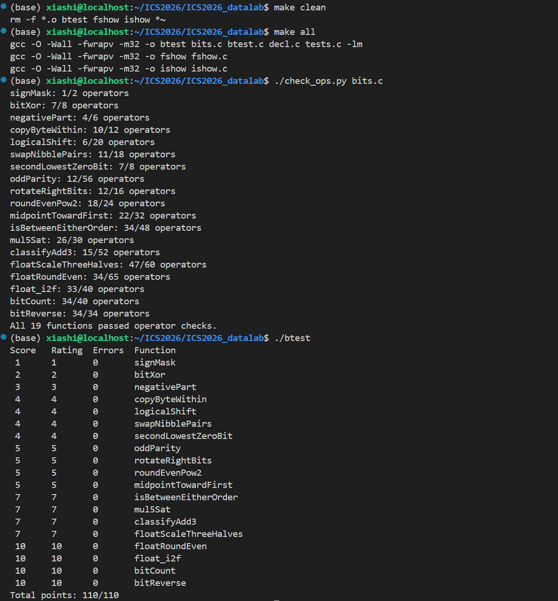

## Lab1 ：datalab

<u>**陈元锞              25303050002**</u>

### 本地执行截图



### 实现每个函数的思路

- `P1 signMask`

  > 本题只需返回`0x80000000`，
  > 也即32位二进制之下的`10000000 00000000 00000000 00000000`
  > 由于允许使用的整数存在范围限制，可以使用较小的整数进行位运算来实现
  > 易知`1 << 31`符合要求。

- `P2 bitXor`

  >本题要求使用&和~实现两个整数的异或操作，因为对32位整数的运算可以认为是逐个bit的操作，因此考虑对一个bit进行运算的真值表，利用&和~，我们容易找到二者同为0和同为1的位置，也即：
  >```C
  >int i = x & y;
  >int j = (~x) & (~y);
  >```
  >
  >而异或操作对应的真值表中，同为1和0的位置应当为0，而剩下的位置为1，所以需要返回的就是`(~i) & (~j)。`

- `P3 negativePart`

  > 本题中，对于非负数，要求返回0；对于负数，要求返回相反数，可以利用`signmask`来完成“条件选择”。
  > 相反数对应的算术操作为`(~x) + 1`，` signmask`的构造原理是利用算术右移对符号位的区分，对于负数，`x >> 31`得到的是`0xFFFFFFFF`，而非负数得到0，因此只需要再做一步按位与即可得到符合题意的结果。

- `P4 copyByteWithin`

  >要完成本题的操作，可以拆分成三个步骤：
  >
  >1. 提取src字节：`int i =(x >> (src  << 3)) & 0xFF;`，这里将src对应的byte移到低八位，通过和`0xFF`进行与运算可以将其取出。
  >2. 清零dst字节：`int j = x & (~(0xFF << (dst << 3)));`为了实现将dst字节清零，可以构造一个只有dst字节为0，其他位置为1的`bit mask`，再将其与原整数x按位与，从而仅将dst字节清零，同时保持其他位不变。
  >3. 把src字节放入dst：`int k = j | (i << (dst << 3));`，先把src字节挪到dst的位置，然后与x做相加或者按位或即可。

- `P5 logicalShift`

  > 本题要实现的是逻辑右移，因为题目使用的是算术右移，高位由符号位补充，而逻辑右移一律补0。对于`x >> n`得到的值，与高n位为0，其他位为1的mask做按位与即可清除符号位扩展产生的1。直观的想法是构造`0xFFFFFFFF`再右移n位，但由于算术右移会在高位补1，故行不通，因此想到先构造高n位为1，其他位为0的数，再按位取反：
  >
  > 由P1，可由`1 << 31`得到`0x80000000`，先右移n位，再左移1位，取反后即得所需mask，再和`x >> n`做按位与即可。

- `P6 swapNibblePairs`

  > 本题要实现的是将每个Byte的高四位和低四位交换位置，可以将每个byte的高四位和低四位分别取出，移位之后再相加，为此需要构造一个mask`0x0F0F0F0F`（如果使用`0xF0F0F0F0`，会因为算术右移高位补1出现问题），可由`0x0F`多次移位相加得到
  > (`int i = 0x0F + (0x0F << 8) + (0x0F << 16) + (0x0F << 24);`)，之后直接做一步按位与取出低4位（`int low = x & i;`），对x右移4位再做按位与取出高四位(`int high = (x >> 4) & i;`)，将取出的低四位左移4位到原先高四位的位置，与取出的高四位相加即可。（ `(low << 4) + high`）

- `P7 secondLowestZeroBit`
  > 本题要求找到x从低到高第二个0出现的位置，如果找不到，就返回0；找到了，就返回一个只在该位置为1，其他位置为0的数。首先要处理第一个0的位置，利用取反将处理对象变为第一个1（`int y = ~x`），此时利用 `int i = y & (y - 1)` 可清除最低位的 1，由于运算符限制，`-1`在此处应写为 `+~0`，随后使用`i & （-i）`提取目前最低位的1（也即原先x从低到高的第二个0，如果没有就返回0），按补码规则将`-i`写为`~i + 1`，得到最终结果。

- `P8 oddParity`

  > 题目要求根据 x 的二进制表示中 1的个数判断奇偶性：当 1的个数为偶数时返回 1，为奇数时返回 0。
  > 由于异或运算具有奇偶性累积的性质，将若干二进制位依次异或后，当其中 1 的个数为奇数时结果为 1，为偶数时结果为 0。因此，可以通过将 x 的 32 个二进制位逐步异或合并，把全部位的奇偶性压缩到最低位。
  > 具体实现采用异或折叠（XOR folding）。先将高 16 位与低 16 位异或，使 32 位信息折叠为 16 位；随后依次右移 8、4、2、1 位并与当前结果异或，将最终的信息存储在最低位，由于此时的奇偶性与题目相反，再做一步逻辑非取反即可。

- `P9 rotateRightBits`

  > 本题要求在右移的基础上，将低位移动的数位次序补到高位。首先通过 `int s = n & 31` 将循环右移位数限制在 0–31。利用P5中的构造方法，将x逻辑右移s位；循环至高位的部分，可直接将x左移`32-s`位，但此时无法处理`s=0`的边界情况，故将左移量写为`(~s + 1) & 31`(等价于`(32-s) & 31`)，最终按位或合并两部分。

- `P10 roundEvenPow2`

  > 根据题意，可以分成两个步骤：
  >
  > 1. 将x分解为`quotient * 2^n + remiander`的格式：
  >    其中2^n（`block`）和 `quotient`的构造可以直接使用移位运算，而`remainder`可以借助一个低n位为1，其他位为0的mask，通过x与其按位与来得到。容易知道这样的mask等于2^n-1。
  > 2. 将比较与条件判断转换成0/1标志位：
  >    最终返回结果首先要看`remainder`与`half(block/2)`的比较，利用二者相减，符号位为1的信息，可以得到`remainder > half`，记为`greater`
  >    （`int greater = ((half + (~remainder + 1)) >> 31) & 1;`）
  >    若二者相等，可以通过异或运算来判定，记为`equal`
  >    考虑需要`quotient+1`的情况：`remainder`大于 `block/2` 或者 二者相等并且`quotient`此时为奇数，因此可以使标志位尽量为1，条件可以表示为
  >    `int roundUp = greater | (equal & odd)`
  >    此时`int equal = !(remainder ^ half)`，而`odd`只需看最低位是否为1，因此可以直接让`int odd = quotient & 1`
  >
  > 最终返回值即为`(quotient + roundUp) << n`

- `P11 midpointTowardFirst`

  > 根据题目要求，可以分成两个步骤：
  >
  > 1. 计算均值：
  >    为了避免溢出，这里不能直接将两个int值相加，根据$x+y=2(x\&y)+(x\oplus y)$，可以直接将右式除以2得到均值，即`int average = (x & y) + ((x ^ y) >> 1)`
  > 2. 根据规则进行舍入：
  >    容易判断，当累加和为奇数时，需要根据x和y的大小关系进行舍入，当x较大时要将`average + 1`，因此标志位可以表示为`odd & greater`，应当为1.
  >      累加和是否为奇数，只需要看最低位是否一致，因此只需异或后取出最低位，也即
  >      `int odd = (x ^ y) & 1`
  >      对于大小判断，因为x和y的值是任取的，为了避免溢出，需要先对符号位做判断，因此将x，y右移31位得到二者的符号位（`int sx = x >> 31;int sy = y >> 31`）
  >      当符号位相同时，可以沿用`P10`的`greater`标志位进行表示（严格来说，本题中这里包含了等于的情况，但因为结合了odd的条件判断，故不会影响最终结果）
  >      (`int diff = x + (~y + 1)`)，符号位不同时，根据x的符号位即可确定大小，上述条件分支可写为
  >      `int greaterMask = (signDiff & ~sx) | (~signDiff & ~(diff >> 31))`
  >      `greater`标志位只取最低位，也即`int greater = greaterMask & 1;`
  >
  > 最终返回`average + (odd & greater)`

- `P12 isBetweenEitherOrder`

  > 本题需要判断x是否位于闭区间[a,b]中，可以沿用P11的方法，将x分别与两个端点比较，用标志位`ge_a`和`ge_b`进行表示，因此对二者异或，可以保证x位于开区间(a,b)中；再考虑端点情形，也即`x==a | x==b`
  > 因此最终返回`(ge_a ^ ge_b) | !(x ^ a) | !(x ^ b)`

- `P13 mul5Sat`

  > 本题需要返回x*5之后的值，容易通过`x << 2 + x`来实现，但同时需要处理溢出的情况，采取的方式是寻找边界值，通过比较结果来构造选择掩码。通过计算，`|x| >429496729(0x19999999)`时会发生溢出，故构造一个边界值T，通过比较来判断是否发生溢出。对于正溢出和负溢出的情况需要分开处理，可以借助x的符号位sx来帮助判断。
  >
  > ```c
  >   int Poverflow = (~sx) & ((T + (~x + 1)) >> 31);
  >   int Noverflow = sx & ((x + T) >> 31);
  >   int overflow = Poverflow | Noverflow;
  > ```
  >
  > 
  >
  > 对于`INT_MAX和INT_MIN`的构造可以通过`int sat = sx ^ ~(1 << 31)`实现，最终返回`(overflow & sat) | (~overflow & result)`

- `P14 classifyAdd3`

  > 本题需要处理三数相加之和，为了避免直接溢出，可以将每个数拆分成高位部分和低位部分分别相加，可以将32位补码整数分解: `x = (x >> 2) * 4 + (x & 3)`
  > 因此可以分成两步计算，并处理进位，得到的是`sum = 4q + r`
  >
  > ```c
  > int q = (x >> 2) + (y >> 2) + (z >> 2);
  > int r = (x & 3) + (y & 3) + (z & 3);
  > q = q + (r >> 2);
  > r = r & 3;
  > ```
  >
  > 而整数溢出边界`INT_MAX = 2147483647 = 4 * (2^29 - 1) + 3; INT_MIN = -2147483648 = 4 * (-2^29)`
  >
  > 因此只需将q的值与边界进行比较就可以判断整个sum是否溢出，分别根据比较结果来表示正溢出和负溢出的标志位，故只要得到进位之后的q值即可
  > ```C
  >   int bound = 1 << 29;
  >   int maxQ = bound + ~0;
  >   int po = ((maxQ + (~q + 1)) >> 31) & 1;
  >   int no = ((q + bound) >> 31) & 1;
  > ```
  >
  > 最终返回`po + (~no + 1)`

- `P15 floatScaleThreeHalves`

  > 首先提取浮点数的三个字段：符号位sign、阶码exp和尾数frac；
  > 对于 NaN 和无穷大(exp == 255)，直接返回原值；
  > 对于非规格化数（exp == 0），不存在隐含的最高位 `1`，因此直接将尾数乘 3 后除以 2，并按照 round-to-nearest-even 规则舍入；若结果达到最小规格化数的范围，则相应设置阶码。
  >
  > ```c
  >  if (exp == 0) {
  >     prod = frac + (frac << 1);
  >     q = prod >> 1;
  > 
  >     if ((prod & 1u) && (q & 1u)) {
  >       q = q + 1;
  >     }
  > 
  >     if (q >= 0x800000u) {
  >       return sign | (1u << 23) | (q & 0x7FFFFFu);
  >     }
  >      
  >     return sign | q;
  >   }
  > ```
  >
  > 对于规格化数(0 < exp < 255)，补上隐含的最高位得到 24 位有效数，并计算其 \(3/2\) 倍。
  >
  > ```C
  >   sig = 0x800000u | frac;
  >   prod = sig + (sig << 1);
  > ```
  >
  > 当结果仍处于当前指数区间时直接对 `prod/2` 舍入；若有效数需要重新规格化，则指数增加 1，并在新的精度下对 `prod/4` 进行舍入。若指数进一步增大到无穷大的编码，则返回无穷大的位模式。
  >
  > ```c
  > if (exp == 254u) {
  >     return sign | 0x7F800000u;
  > }
  > 
  > q = prod >> 2;
  > rem = prod & 3u;
  > 
  > if (rem > 2u || (rem == 2u && (q & 1u))) {
  >     q = q + 1;
  > }
  > 
  > exp = exp + 1;
  > 
  > return sign | (exp << 23) | (q & 0x7FFFFFu);
  > ```

- `P16 floatRoundEven`

  > 首先提取浮点数字段，然后处理特殊情况：
  >
  > - NaN和无穷大：直接返回
  >
  > - 已经是整数：直接返回
  >
  > - 绝对值小于0.5：返回sign
  >
  > - 绝对值在[0.5， 1.0)之间：如果 `frac == 0`，值正好是 `0.5`。根据 round to nearest even，`0.5` 舍入到 `0`（因为 0 是偶数），所以返回 `sign`（`±0`）。
  >
  >   如果 `frac != 0`，值大于 `0.5`，舍入到 `1.0`，返回 `sign | 0x3F800000`（`±1.0` 的位模式）
  >
  >   ```c
  >   if (exp == 0xFFu) {
  >       return uf;
  >     }
  >   
  >     if (exp >= 150u) {
  >       return uf;
  >     }
  >   
  >     if (exp < 126u) {
  >       return sign;
  >     }
  >   
  >     if (exp == 126u) {
  >       if (frac == 0) {
  >         return sign;
  >       }
  >       return sign | 0x3F800000u;
  >     }
  >   ```
  >
  > 对于其余情况，根据阶码计算尾数中小数部分所占的位数 `k`，利用掩码将 24 位有效数拆分为整数部分和被舍弃部分。比较余数rem与半程值half：超过半程时向上舍入，等于半程时检查保留部分最低位，仅在其为奇数时进位，从而实现 round-to-nearest-even。
  > ```c
  >   k = 150u - exp;
  >   sig = 0x800000u | frac;
  >   mask = (1u << k) - 1u;
  >   rem = sig & mask;
  >   half = 1u << (k - 1u);
  >   base = sig & ~mask;
  > 
  >   if (rem > half ||
  >       (rem == half && ((base >> k) & 1u))) {
  >     base = base + (1u << k);
  >   }
  > ```
  >
  > 若进位使有效数产生新的最高位，则右移有效数并增加阶码
  > ```C
  > if (base & 0x1000000u) {
  >     base = base >> 1;
  >     exp = exp + 1;
  > }
  > ```
  >
  > 最终返回`sign | (exp << 23) | (base & 0x7FFFFFu);`

- `P17 float_i2f`

  > 首先处理0和符号，由于x是int而mag为unsigned，当x<0时，需要设置符号位，并对mag取反加一，从而取得x绝对值的无符号表示。
  >
  > ```C
  > unsigned sign = 0;
  > unsigned mag = x;
  > ...
  > if (x == 0) {
  >     return 0;
  > }
  > 
  > if (x < 0) {
  >     sign = 0x80000000u;
  >     mag = ~mag + 1u;
  > }
  > ```
  >
  > 随后从最高位开始寻找最高有效 `1` 的位置 `p`。由于整数的最高有效位对应浮点数规格化表示中的隐含 `1`，故浮点阶码为 `p + 127`。
  > ```C
  > p = 31;
  >   while (((mag >> p) & 1u) == 0) {
  >     p = p - 1;
  >   }
  > 
  >   exp = p + 127;
  > ```
  >
  > 接着处理尾数，若 `p <= 23`，整数所有有效位均能完整放入单精度浮点数的 24 位有效精度中，只需左移对齐，不发生精度损失。若 `p > 23`，则必须舍弃最低的 `p-23` 位。将被舍弃部分rem与半程值half比较，并在恰好一半时检查保留有效数最低位，从而完成 round-to-nearest-even 舍入。若舍入产生新的最高位，则将有效数右移并增加阶码。
  > ```c
  > if (p <= 23) {
  >     frac = (mag << (23 - p)) & 0x7FFFFFu;
  >   } else {
  >     shift = p - 23;
  >     sig = mag >> shift;
  > 
  >     mask = (1u << shift) - 1u;
  >     rem = mag & mask;
  >     half = 1u << (shift - 1u);
  > 
  >     if (rem > half ||
  >         (rem == half && (sig & 1u))) {
  >       sig = sig + 1u;
  > 
  >       if (sig & 0x1000000u) {
  >         sig = sig >> 1;
  >         exp = exp + 1u;
  >       }
  >     }
  >      frac = sig & 0x7FFFFFu;
  >   }
  > ```
  >
  > 最后组合符号位、阶码和尾数字段，返回结果即可。

- `P18 bitCount`

  > 利用分组并行计数的方法，每一轮将较小位段中的局部计数合并到更大的位段中，使计数信息逐级从 2 位、4 位、8 位扩展到 32 位，最终在最低若干位得到整个整数中 `1` 的数量，为此需要先构造三个掩码用于取出不同的位段
  > ```c
  >   int mask1 = 0x55 + (0x55 << 8) + (0x55 << 16) + (0x55 << 24);
  >   int mask2 = 0x33 + (0x33 << 8) + (0x33 << 16) + (0x33 << 24);
  >   int mask4 = 0x0F + (0x0F << 8) + (0x0F << 16) + (0x0F << 24);
  > ```
  >
  > 然后将位段逐级扩展：
  > ```C
  >   x = (x & mask1) + ((x >> 1) & mask1);
  >   x = (x & mask2) + ((x >> 2) & mask2);
  >   x = (x + (x >> 4)) & mask4;
  >   x = x + (x >> 8);
  >   x = x + (x >> 16);
  > ```
  >
  > 而32位数最多只会有32个1，因此只需返回低6位`x & 0x3F`

- `P19 bitReverse`

  > 采用逐级交换位块的方式实现32位反转。首先交换高、低 16 位，再依次交换每组中的 8 位、4 位、2 位和 1 位子块。每一级均利用掩码选取块的低半部分，并通过左右移和按位或交换两个子块。
  > (如交换高低16位为` x = ((x >> 16) & mask) | (x << 16)`)
  > 经过五轮交换后，每一位的位置均映射到原位置 `31-i`，完成 32 位反转。
  > 由于操作数限制，不能分别构造五个完整掩码，故从 `0x0000FFFF` 出发，通过 `mask ^ (mask << k)` 逐步生成下一层所需掩码，依次为`0x0000FFFF, 0x00FF00FF, 0x0F0F0F0F, 0x33333333, 0x55555555`